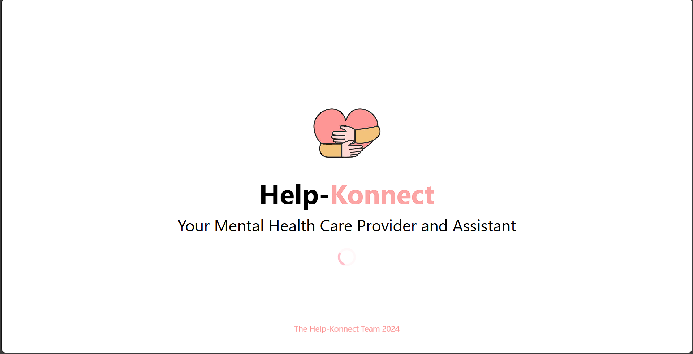

# HelpKonenct's Admin Web Repository

The Admin Application of HelpKonnect for both Developers and Partnered/Subscribed Facilities, this include features for:

Partnered Facilities an Analytics Dashboard, Registering of Mental Health Professionals, Reservation System to show booked users to Professionals, Resources from Professionals or the Facility to be distributed to the General User, Events for Participation, Community Posting and Messaging Users between both Mobile and Web Platforms.

Developers has Analytics for the Whole Platform, Registering of Incoming Partnered Facilities, Moderation of the Community, and other features included from Partnered Facilities.

## Screenshots

## Authors

- [@ajiwnl](https://www.github.com/ajiwnl)
- [@UnusualRuWei](https://www.github.com/UnusualRuWei)

## Tech Stack

**Development:** NextJS, Firebase, React, TailwindCSS, JavaScript

  
  
  
  
  
  
  
  
  

###

**APIs:** Purgomalum Text Filtering

**Deployment:** Vercel
